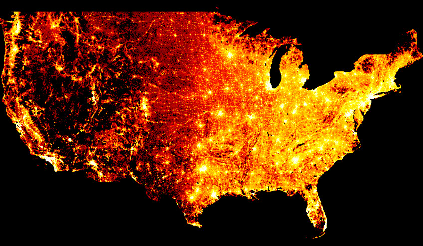
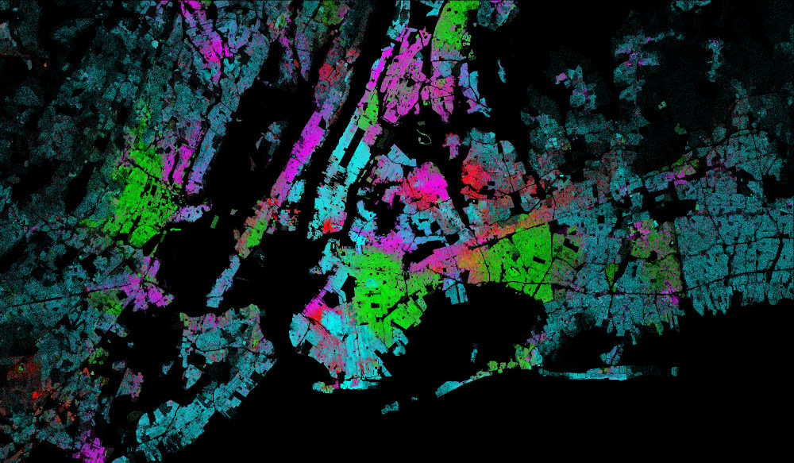

Datashader
----------

[](https://travis-ci.org/bokeh/datashader)
[](http://datashader.readthedocs.org/en/latest/?badge=latest)
[](https://waffle.io/bokeh/datashader)


Datashader is a data rasterization pipeline for automating the process of
creating meaningful representations of large amounts of data. Datashader
breaks the creation of images of data into 3 main steps:

1. Projection

   Each record is projected into zero or more bins of a nominal plotting grid
   shape, based on a specified glyph.

2. Aggregation

   Reductions are computed for each bin, compressing the potentially large
   dataset into a much smaller *aggregate* array.

3. Transformation

   These aggregates are then further processed, eventually creating an image.

Using this very general pipeline, many interesting data visualizations can be
created in a performant and scalable way. Datashader contains tools for easily
creating these pipelines in a composable manner, using only a few lines of code.
Datashader can be used on its own, but it is also designed to work as
a pre-processing stage in a plotting library, allowing that library
to work with much larger datasets than it would otherwise.


## Installation

Datashader is available on most platforms using the 
[`conda` package manager](https://conda.io/docs/install/quick.html),
from the `bokeh` channel:

```
conda install -c bokeh datashader
```

If you wish, you can manually install from the git repository to allow
local modifications to the source code:

```
git clone https://github.com/bokeh/datashader.git
cd datashader
conda install -c bokeh --file requirements.txt
python setup.py develop
```

Datashader is not currently provided on pip/PyPI, to avoid broken or
low-performance installations that come from not keeping track of
C/C++binary dependencies such as LLVM (required by Numba).


## Examples

The above commands will install only the minimal dependencies required
to run datashader itself. Datashader also ships with a large number of
[example files and notebooks](https://anaconda.org/jbednar/notebooks).
If you have installed datashader and want to run these yourself, just
follow the instructions at the [examples README](https://raw.githubusercontent.com/bokeh/datashader/master/examples/README.md).

If you want to skip a step, you can install datashader together with
all the examples and datafiles in a single environment if you download the
[conda ds environment file](https://raw.githubusercontent.com/bokeh/datashader/master/examples/environment.yml),
name it "environment.yml" on your local machine, then do:

```
conda env create environment.yml
source activate ds
```

(or `activate ds`, on Windows).  You can then follow the instructions
in the
[examples README](https://raw.githubusercontent.com/bokeh/datashader/master/examples/README.md),
skipping step 4 as the required packages will already be installed.  You should 
now be able to run the examples and use them as a starting point for your own work.


## Learning more

Additional resources are linked from the
[datashader documentation](http://datashader.readthedocs.org), including
API documentation and papers and talks about the approach.

## Screenshots






